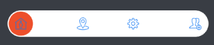
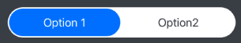
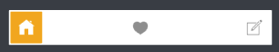
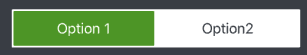
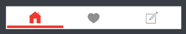
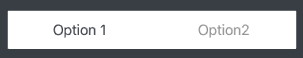

# MASegmentedControl

[](https://github.com/alokc83/WeatherInfo/graphs/commit-activity)

 <br>
[](https://github.com/alokc83/MASegmentedControl/issues)
[](https://github.com/ellerbrock/open-source-badges/)
[](https://github.com/alokc83/MASegmentedControl/blob/master/LICENSE)

Super customizable Segmented Control for iOS. 
Following examples can give you idea how it can be customized. All this customization can be written anywhere before rendering of the control. Most desirable place is `didSet block.`

### Integrating with cococapods:
----
##### Integrating latest version
```
pod 'MASegmentedControl'

```
##### Integrating specific version
```
pods 'MASegmentedControl', '~> 0.0.3'

```

### Integrating with Carthage:
----
##### Integrating latest version
```
github "alokc83/MASegmentedControl"

```
##### Integrating specific version
```
github "alokc83/MASegmentedControl" ~> 0.0.3

```

### Circular segment:
----
 <br>
You would need to provide the image array that can be a array of image litrals or array of UIImage. 

```
 imagesSegmentedControl.fillEqually = false
 imagesSegmentedControl.buttonsWithDynamicImages = true
 imagesSegmentedControl.roundedControl = true
            
 // images is the array of image litrals 
 imagesSegmentedControl.setSegmentedWith(items: images)
 imagesSegmentedControl.padding = 2
 imagesSegmentedControl.thumbViewColor = #colorLiteral(red: 0.9372549057, 
 											green: 0.3490196168, 
 											blue: 0.1921568662, 
 											alpha: 1)
```

<p>
 
### Rounded corner segment: 
----


```
didSet {
        //Set this booleans to adapt control
        textSegmentedControl.itemsWithText = true
        textSegmentedControl.fillEqually = true
        textSegmentedControl.roundedControl = true
            
        textSegmentedControl.setSegmentedWith(items: ["Option 1", "Option2"])
        textSegmentedControl.padding = 2
        textSegmentedControl.textColor = #colorLiteral(red: 0.2549019754, 
     											green: 0.2745098174, 
     											blue: 0.3019607961, 
    											alpha: 1)
        textSegmentedControl.selectedTextColor = #colorLiteral(red: 1, 
        									green: 1, 
        									blue: 1, 
        									alpha: 1)
        textSegmentedControl.thumbViewColor = #colorLiteral(red: 0, 
        										green: 0.4784313725, 
        										blue: 1, 
      											alpha: 1)
        textSegmentedControl.titlesFont = UIFont(name: "OpenSans-Semibold", size: 14)
}
```

<p>
 
### Square design with image: 
----


```

didSet {
        //Set this booleans to adapt control
        iconsSegmentedControl.itemsWithText = false
        iconsSegmentedControl.fillEqually = false
        iconsSegmentedControl.roundedControl = false
            
        // icons is the array of image litrals 
        iconsSegmentedControl.setSegmentedWith(items: icons)
        iconsSegmentedControl.padding = 2
        iconsSegmentedControl.thumbViewColor = #colorLiteral(red: 0.9529411793, green: 0.6862745285, blue: 0.1333333403, alpha: 1)
        iconsSegmentedControl.buttonColorForNormal = #colorLiteral(red: 0.6000000238, green: 0.6000000238, blue: 0.6000000238, alpha: 1)
        iconsSegmentedControl.buttonColorForSelected = #colorLiteral(red: 1, green: 1, blue: 1, alpha: 1)
  }
```

<p> 
 
### Square text design:
----


```
didSet {
        //Set this booleans to adapt control
        textSquareSegmentedControl.itemsWithText = true
        textSquareSegmentedControl.fillEqually = true
            
        let strings = ContentDataSource.textItems()
        textSquareSegmentedControl.setSegmentedWith(items: strings)
        textSquareSegmentedControl.padding = 2
         textSquareSegmentedControl.textColor = #colorLiteral(red: 0.2549019754, green: 0.2745098174, blue: 0.3019607961, alpha: 1)
        textSquareSegmentedControl.selectedTextColor = #colorLiteral(red: 1, green: 1, blue: 1, alpha: 1)
         textSquareSegmentedControl.thumbViewColor = #colorLiteral(red: 0.3411764801, green: 0.6235294342, blue: 0.1686274558, alpha: 1)
  }
```

<p>
 
### Youtube style design:
----


```
didSet {    
        //Set this booleans to adapt control
        youtubeLikeSegmentedControl.itemsWithText = false
        youtubeLikeSegmentedControl.bottomLineThumbView = true
        youtubeLikeSegmentedControl.fillEqually = true
            
        // icons is the array of image litrals 
        youtubeLikeSegmentedControl.setSegmentedWith(items: icons)
        youtubeLikeSegmentedControl.padding = 2
        youtubeLikeSegmentedControl.thumbViewColor = #colorLiteral(red: 0.9411764706, green: 0.2549019608, blue: 0.2020437331, alpha: 1)
        youtubeLikeSegmentedControl.buttonColorForNormal =  #colorLiteral(red: 0.6000000238, green: 0.6000000238, blue: 0.6000000238, alpha: 1)
        youtubeLikeSegmentedControl.buttonColorForSelected = #colorLiteral(red: 0.9411764706, green: 0.2549019608, blue: 0.2020437331, alpha: 1)
  }
```

<p>
 
### Simple text highlight design:
-----


```
didSet {
            
       //Set this booleans to adapt control
       hiddenThumbViewSegmentedControl.itemsWithText = true
       hiddenThumbViewSegmentedControl.fillEqually = true
       hiddenThumbViewSegmentedControl.thumbViewHidden = true
            
       hiddenThumbViewSegmentedControl.setSegmentedWith(items: ["Option 1", "Option 2"])
       hiddenThumbViewSegmentedControl.padding = 2
       hiddenThumbViewSegmentedControl.textColor = #colorLiteral(red: 0.6000000238, green: 0.6000000238, blue: 0.6000000238, alpha: 1)
       hiddenThumbViewSegmentedControl.selectedTextColor = #colorLiteral(red: 0.2549019754, green: 0.2745098174, blue: 0.3019607961, alpha: 1)
        }
```

 
<p>
 
### Simple text highlight with underbar design:
-----


```
didSet {
        //Set this booleans to adapt control
        linearThumbViewSegmentedControl.itemsWithText = true
        linearThumbViewSegmentedControl.fillEqually = true
        linearThumbViewSegmentedControl.bottomLineThumbView = true
            
        linearThumbViewSegmentedControl.setSegmentedWith(items: ["Option 1", "Option 2", "Option 3"])
        linearThumbViewSegmentedControl.padding = 2
        linearThumbViewSegmentedControl.textColor = #colorLiteral(red: 0.6000000238, green: 0.6000000238, blue: 0.6000000238, alpha: 1)
        linearThumbViewSegmentedControl.selectedTextColor = #colorLiteral(red: 0.2549019754, green: 0.2745098174, blue: 0.3019607961, alpha: 1)
         linearThumbViewSegmentedControl.thumbViewColor = #colorLiteral(red: 0.9372549057, green: 0.3490196168, blue: 0.1921568662, alpha: 1)     
  }
```

[]()
